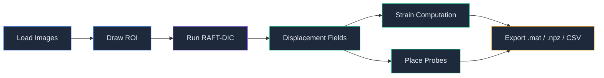
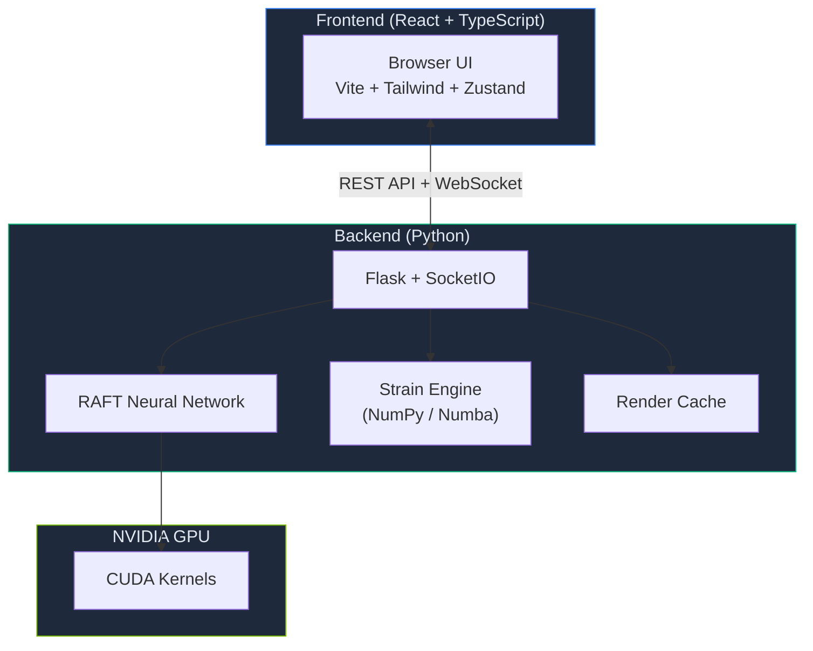

<div align="center">

<!-- TODO: Add banner image (recommended: 1280x640px, dark background + UI screenshots + logo)
     Save to docs/images/banner.png -->
<!--  -->

# RAFTcorr

### GPU-Accelerated Digital Image Correlation Powered by Deep Learning

Full-field displacement and strain analysis through an interactive web interface,<br>
built on the [RAFT](https://github.com/princeton-vl/RAFT) optical flow network with CUDA acceleration.

[](https://colab.research.google.com/github/zachtong/RAFTcorr/blob/main/notebooks/RAFTcorr_Colab.ipynb)
[](https://www.python.org/)
[](https://pytorch.org/)
[](https://developer.nvidia.com/cuda-toolkit)

</div>

---

<!-- TODO: Add demo GIF (30-60s workflow recording)
     Record: Load images -> Draw ROI -> Process -> View displacement -> Place probes
     Tools: ScreenToGif or OBS, save to docs/images/demo.gif, keep under 10MB -->
<!-- <p align="center">
  
</p> -->

## Why RAFTcorr?

Traditional DIC relies on iterative subset matching — users must hand-tune subset size, step size, strain windows, and convergence criteria. Performance degrades on large deformations, low-texture surfaces, and noisy images.

RAFTcorr replaces the entire correlation pipeline with **RAFT** (Recurrent All-Pairs Field Transforms), a deep learning optical flow model trained specifically for DIC.

### How RAFTcorr compares

<!-- TODO: Verify speed numbers with your actual benchmarks -->

|  | Ncorr | DICe | VIC-2D | **RAFTcorr** |
|---|---|---|---|---|
| **Algorithm** | Subset matching | Subset matching | Subset matching | ${\color{green}\textsf{Deep learning optical flow}}$ |
| **Speed** | ~10⁴ POI/s | ~10⁴ POI/s | ~10⁴ POI/s | ${\color{green}\textsf{~10⁶ POI/s (GPU)}}$ |
| **Large displacement** | Limited | Limited | Moderate | ${\color{green}\textsf{Native support}}$ |
| **Low-texture robustness** | Poor | Poor | Moderate | ${\color{green}\textsf{Strong}}$ |
| **Parameters to tune** | 5+ | 5+ | 5+ | ${\color{green}\textsf{0 — neural network}}$ |
| **Platform** | MATLAB (paid) | C++ | Windows only | ${\color{green}\textsf{Python (cross-platform)}}$ |
| **Cost** | Free (MATLAB req.) | Free | $10,000+ | ${\color{green}\textsf{Free}}$ |
| **Open source** | Yes | Yes | No | Yes |
| **Active development** | Inactive since ~2020 | Inactive since ~2021 | Proprietary | ${\color{green}\textsf{Active}}$ |

<details>
<summary><b>vs. open-source DIC tools (Ncorr, DICe)</b></summary>

- **Algorithm generation gap** — Ncorr and DICe use subset-based correlation, an approach from the 2000s. RAFTcorr uses deep learning optical flow, which handles sparse textures and large deformations where subset methods fail.
- **Modern platform** — Python ecosystem vs. MATLAB/C++. Easier to integrate into existing research pipelines, no paid MATLAB license required.
- **Actively maintained** — Both Ncorr and DICe communities have largely gone dormant. RAFTcorr is under active development by the research authors themselves.
- **Academically validated** — Not a hobby project — backed by peer-reviewed research from UT Austin.

</details>

<details>
<summary><b>vs. commercial software (VIC-2D/3D, GOM Correlate, etc.)</b></summary>

- **Free** — Eliminates the biggest barrier. Labs that cannot afford $10k+ licenses can run the same analysis at no cost.
- **Open source & customizable** — Commercial DIC tools are black boxes. RAFTcorr is fully transparent — inspect, modify, and extend every line of code.
- **Algorithm transparency** — Academic users need to understand and cite the methods they use. Commercial software cannot provide this.
- **Direct access to the authors** — File an issue, get a response from the people who built the algorithm. Commercial support cannot replicate this.

</details>

> **No GPU?** Try it free on [Google Colab with a T4 GPU](https://colab.research.google.com/github/zachtong/RAFTcorr/blob/main/notebooks/RAFTcorr_Colab.ipynb).

---

## Features

<table>
<tr>
<td width="50%">

**Analysis**
- Deep-learning optical flow (RAFT-Large / RAFT-Small)
- Accumulative and incremental processing modes
- Green-Lagrange & engineering strain computation
- Principal strain directions with overlay visualization
- Adjustable smoothing (displacement & strain)

</td>
<td width="50%">

**Interactive GUI**
- Browser-based — no desktop app to install
- ROI tools: rectangle, polygon, circle, mask import
- Virtual extensometers: point, line, and area probes
- Real-time colormap visualization with opacity control
- Frame-by-frame playback with pre-render cache

</td>
</tr>
<tr>
<td width="50%">

**Export & Data**
- Scientific export: MATLAB (`.mat`) and NumPy (`.npz`)
- CSV time-series export for probe data
- Batch image export with per-component color range & DPI
- Chart PNG/CSV download for time-series plots
- Physical unit conversion (mm, in, m)

</td>
<td width="50%">

**Performance**
- CUDA-accelerated RAFT inference
- Custom CUDA correlation kernel (`alt_cuda_corr`)
- Memory-aware render cache (auto-sized)
- Concurrent pre-render workers for smooth playback
- One-click install on Windows (`install.bat`)

</td>
</tr>
</table>

---

## Screenshots

<!-- TODO: Replace with real screenshots showing actual experimental data.
     Take full-window screenshots (16:9) of each tab with data loaded.
     Save to docs/images/ directory. -->

<table>
<tr>
<td align="center"><b>ROI Selection</b></td>
<td align="center"><b>Displacement Field</b></td>
</tr>
<tr>
<td>

<!-- Replace: screenshot with images loaded and ROI drawn -->


</td>
<td>

<!-- Replace: screenshot showing colorful displacement overlay -->


</td>
</tr>
<tr>
<td align="center"><b>Strain Analysis</b></td>
<td align="center"><b>Virtual Extensometers</b></td>
</tr>
<tr>
<td>

<!-- Replace: screenshot showing strain field with color bar -->


</td>
<td>

<!-- Replace: screenshot showing probes + time-series chart -->


</td>
</tr>
</table>

---

## Workflow



---

## Quick Start

### Local Installation (NVIDIA GPU Required)

```bash
git clone https://github.com/zachtong/RAFTcorr.git
cd RAFTcorr
```

**Windows (one-click):** double-click `install.bat`, then `run.bat`.

**Command line:**

```bash
conda create -n raftcorr python=3.10 -y
conda activate raftcorr
pip install -e .
python run_prod.py
```

The browser opens automatically at `http://localhost:5000`.

<details>
<summary><b>Prerequisites</b></summary>

- [Anaconda](https://www.anaconda.com/download) or [Miniconda](https://docs.anaconda.com/miniconda/)
- NVIDIA GPU with **CUDA 11.8+** (required for RAFT inference)
- NVIDIA driver installed — verify with `nvidia-smi`
- The installer auto-detects your CUDA version and installs the matching PyTorch build

</details>

### No GPU? Use Google Colab (Free)

[](https://colab.research.google.com/github/zachtong/RAFTcorr/blob/main/notebooks/RAFTcorr_Colab.ipynb)

1. Set runtime to **T4 GPU**: *Runtime → Change runtime type → T4 GPU*
2. **Run all** cells (`Ctrl+F9`)
3. Click the tunnel URL that appears

> Colab provides a free T4 GPU. Visualization may be slower due to network tunneling, but processing is fully GPU-accelerated.

---

## Architecture



<details>
<summary><b>Manual Installation (Linux / Advanced)</b></summary>

```bash
git clone https://github.com/zachtong/RAFTcorr.git
cd RAFTcorr

# Install PyTorch with CUDA (adjust cu124 to your CUDA version)
pip install torch torchvision torchaudio --index-url https://download.pytorch.org/whl/cu124

# Install RAFTcorr
pip install -e .

# Launch
python run_prod.py
```

</details>

<details>
<summary><b>For Developers</b></summary>

To modify the React frontend:

```bash
# Install Node.js 18+, then:
cd frontend
npm install
npm run dev        # dev server with hot reload on port 5173

# In another terminal:
python run_dev.py  # Flask API on port 5000
```

To rebuild the production frontend:

```bash
cd frontend && npm run build
```

</details>

---

## Citation

If RAFTcorr assists your research, please cite:

```bibtex
@software{raftcorr2026,
  author    = {Tong, Zixiang and Bu, Lehu and Shi, Qihang and Du, Runtian and Yang, Jin},
  title     = {{RAFTcorr}: An Open-Source, Deep Learning Digital Image Correlation Framework for Dense Displacement Measurement},
  url       = {https://github.com/zachtong/RAFTcorr},
  note      = {The University of Texas at Austin}
}
```

<!-- TODO: Update with journal paper citation when published -->

---

## Acknowledgments

- **RAFT**: Teed & Deng, [princeton-vl/RAFT](https://github.com/princeton-vl/RAFT) — *RAFT: Recurrent All-Pairs Field Transforms for Optical Flow* (ECCV 2020)
- **RAFT-DIC**: Pan, B. and Liu, Y., *User-independent, accurate and pixel-wise DIC measurements with a task-optimized neural network*, Experimental Mechanics, 2024.
- Developed at **The University of Texas at Austin**

## License

<!-- TODO: Update when license is finalized -->

See [LICENSE](LICENSE.md) for details.
